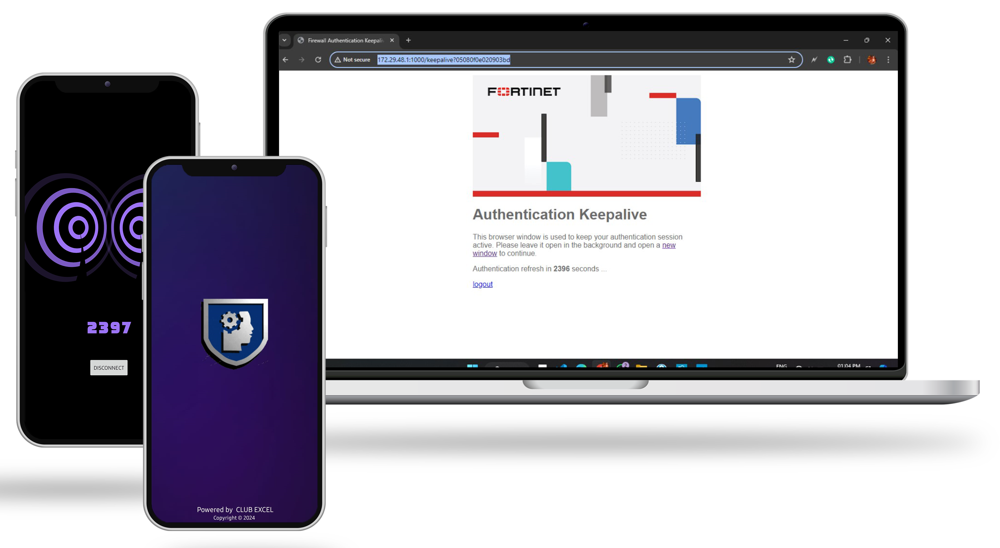
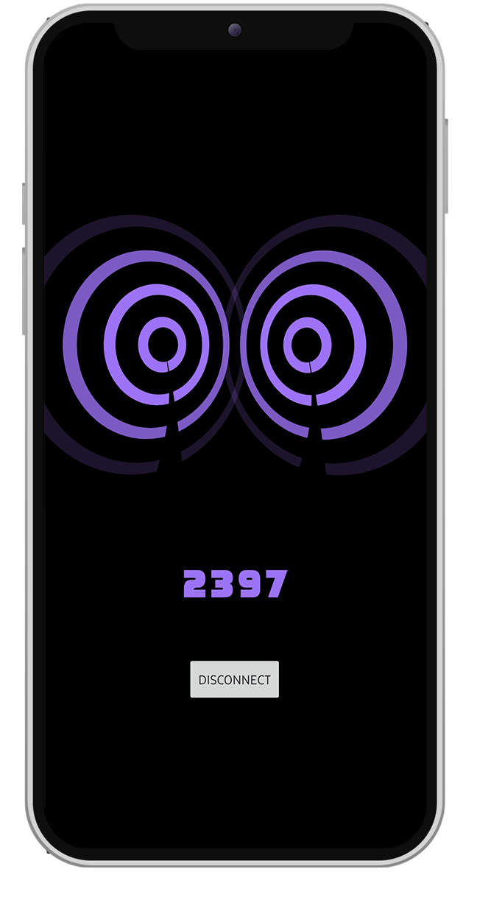
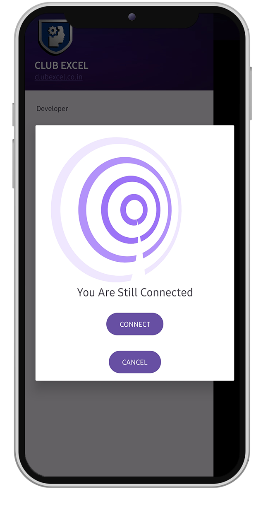
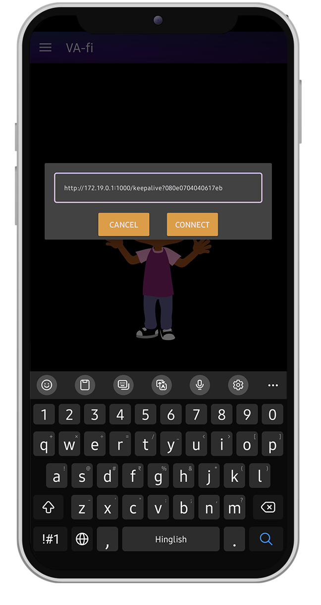
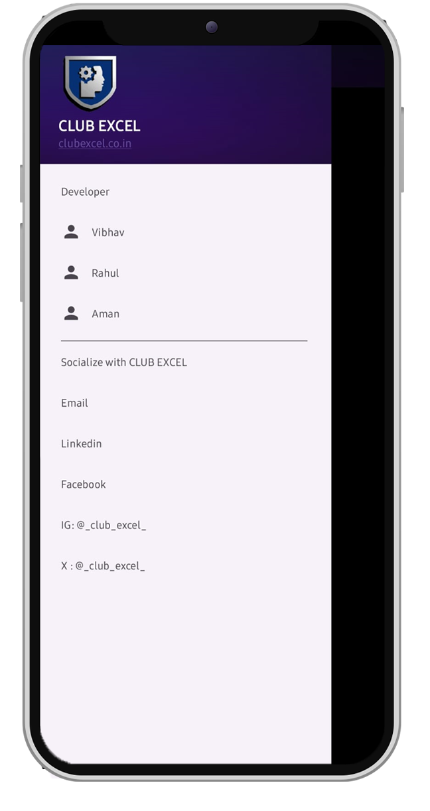

# Va-Fi App

## An app designed to keep campus Wi-Fi connected on Android devices 📶.

## Problem Statement

The main problem for Android users on the campus Wi-Fi is that the connection doesn't last for more than 2400 seconds (40 minutes) ⏳. To restart the connection timer, the page must be refreshed at least once 🔄. However, on Android phones, the Wi-Fi login page often doesn't appear, making refreshing the page a complicated task 😓📱.

## Solution

To maintain a stable connection to the Wi-Fi, we need to refresh the page regularly and regenerate the token 🔄🔑. This process ensures that the connection remains active and prevents any interruptions. Without doing this, the Wi-Fi connection will drop, and we will need to reconnect manually, which can be quite inconvenient 📶.

## How this works

We have set up the page to open and refresh automatically in the background every five minutes ⏲️. This way, the page remains open and active in the background, ensuring a continuous connection without any manual intervention 🔄📱. .

## Different Screens 📱📲📳

Here are the various screens related to the app: 📱

<b>Connected Screen</B>: View the status of your current Wi-Fi connection

<b>Connect Screen: </B>Choose and connect to available Wi-Fi networks.

<b>Enter URL Screen</B>: Input the URL to access the Wi-Fi login page.

<b>Sidebar</B>: Navigate easily to different sections of the app.

<table style="width:100%">
  <tr>
    <th>
 Connected  
 </th>
    <th>
 Connect   
</th>
    <th>
 Enter url  
</th>
  </tr>
  <tr>
    <td>
 
</td>
    <td>

</td>
    <td>

 </td>
  </tr>
  <tr>
    <th>
 Sidebar   
 </th>
  </tr>
  <tr>
    <td>
 
</td>
  </tr>
</table>

---

## About 💡🎯

This is an Android app built with Kotlin and XML using the MVVM design pattern and Dagger Hilt for dependency injection 📱. The app utilizes Room Database to store various URLs for connections. When connected, it refreshes the pages running continuously at fixed intervals. This ensures that Android users remain connected to the Wi-Fi seamlessly 🔄📶.

---

## video 📺💻

https://github.com/Vibhav00/va-fi/assets/101458238/0b1b8de2-2537-4029-84e7-fdc35da421e4" 

---

## Worning ⚠️⛔
